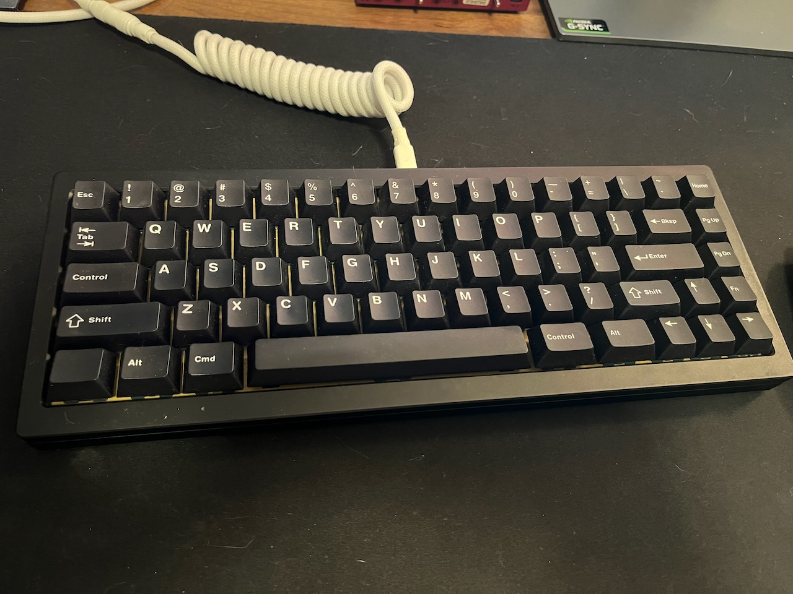

+++
title = 'Aeboard Constellation | Moss Linears'
date = '2022-03-04'
+++

Aeboard Constellation w/ Moss Linears. Brass plate + gasket mount config (it can be configred [3 different ways](https://www.aeboards.com/constellation)).

The springs in the Moss linears were switched out 78g progressive springs from Sprit, lubed with 205g0, and filmed with TX films.
