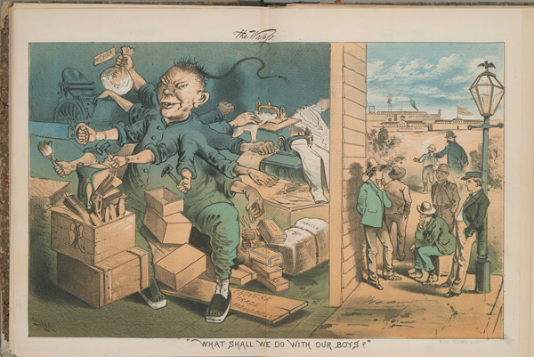

+++
title = 'On "What Shall We Do With Our Boys"'
date = '2017-09-15'
readTime = 'true'
+++

**"What Shall We Do With Our Boys"** is a political cartoon created by George Frederick Keller for the March 3rd, 1882 issue of _The Wasp_. _The San Francisco Illustrated Wasp_ was a weekly satire magazine that focused on political illustrations using lithographs. Many of its readers considered it the West Coast version of _Puck_, another popular satire magazine based on the East Coast (Caswell). During this time, _The Wasp_ focused a large amount of its content on the topic of Asian immigration. Although all of its readers knew the magazine to be openly racist, _The Wasp_ was considered "a force for good, puncturing sham, afflicting the comfortable, bringing down the wicked, and advancing the cause of political reform" (Rawls). It appealed to its West Coast audience, who at this time were inevitably aware of early Asian migrations through hate-filled cartoons which ultimately had corrosive and blinding effects on the subconscious.

**"What Shall We Do With Our Boys"** depicts an eleven-armed Chinese immigrant, hideous and sinister, going to town in a whirlwind of industrial productivities. Some of the tools he is working with include a saw, a mallet, a hammer, a brush, cigar leaves, and sewing machines, suggesting that the early Chinese immigrants dominated labor industries such as logging, shoemaking, construction, painting, cigar making, and tailoring. He is a monster residing inside what appears to be a dark warehouse. Outside of the warehouse, under the beautiful weather, stand five young white boys, all of whom are well dressed in jackets and hats. One of the boys leans against a lamppost with an American eagle sigil on top, others are lost in deep thoughts, all of them obviously unemployed. Behind them, a sixth young boy is being rushed away by a police officer towards a divided road. The road leads to "San Quentin", "Industrial School", or "House of Correction." None of which seems fitting for our innocent young man. What shall we do with them? They are "our boys," after all.

In the years leading up to 1882, the Chinese American population had been slowly growing. About one million Asian immigrants settled in the United States from the mid-19th century to early 20th century, most of whom resided in California (Lee 121). This created what appeared to be a disproportionally large demographic of Asian immigrants on the West Coast and inevitably became a topic of political discussions. The message of the cartoon was loud and clear: something needs to be done to stop the Chinese immigrants from stealing American jobs.

The cartoon shows the Chinese immigrant holding a bag of money labeled "earnings," tagged with the phrase "for China." This refers to the fact that the first few waves of Chinese immigrants were sojourners. Triggered by natural disasters, population growth, and Western invasions during the 19th century, labor sojourning was a common response from southern Asians looking to elevate his or her family’s financial situation (Lee 29). Interesting to note, the wooden plank labeled "Chinese trade monopoly," which suggests that the Chinese had some sort of economic advantage in international trade, was blatantly wrong. After the first Opium War, China was forced to integrate into the international economy, which left the country in shambles. Canton, China’s dominant sea port, was forced to compete with newly opened treaty ports. Desperation concatenated into violence, and many discords such as the Red Turban Rebellion, Taiping Rebellion, or the Hakka-bendi ethnic conflict drove the country's economy to depression (Lee 30).

During this time, there were clear hostilities toward Asian labor workers. They were seen as different, distant, and inferior. In the context of **"What Shall We Do With Our Boys"**, which depicts the American boys standing outside under the clear blue sky while the Chinese monster worked menacingly in the shadowed warehouse, the divided frame is visually clear. This dividedness originated from Orientalism, a term invented by the West to make clear distinctions between itself and the East; as a reflection derived for the purpose of artificial comparisons.

An imaginary idea of a place and culture carried by European immigration to the United States, "The Orient is an integral part of European material civilization and culture. Orientalism expresses and represents that part culturally and even ideologically as a mode of discourse with supporting institutions, vocabulary, scholarship, imagery, doctrines, even colonial bureaucracies and colonial styles" (Said 10). This notion of "The Others" versus "The Whites" permeated the living environment of early Asian immigrants, most of whom were falsely classified into the same group regardless of their ethnicity, culture, or country of origin. For example, in **"What Shall We Do With Our Boys"**, one of the professions the Chinese monster is shown doing is tailoring. In actuality, the group of early Asian immigrants most prominently known for tailoring were the Japanese (Lee 76), but to George Frederick Keller, they were of the same race and the same threat.

In 1790, The Naturalization Act was established, which restricted the right to obtain citizenship to only free whites. Classifying Chinese immigrants as "aliens ineligible for citizenship," many leveraged it as arguments to deny Chinese immigrants from other rights such as land ownership, marriage to American citizens, or immigration (Lee 122). The disparaging timeline of legislations didn’t stop there but instead gained momentum. In 1863, Chinese were prohibited from testimonies, which stood until 1872 when the 14th Amendment had to be conformed to. Even then, testimonies by Chinese were rarely accepted in courts (Lee 122). In 1882, two months after the publication of **"What Shall We Do With Our Boys"**, the Chinese Exclusion Act was passed (Lee 123), which directly targeted a specific group based on ethnicity and degraded them with obvious prejudice. The hysteria felt towards people of Asian origin were translated into law. The fear of Chinese immigrants was utilized by ruling class white Americans to gain cheap labor and to confuse the mass public, giving people the impression that the Chinese were somehow responsible for their unemployment or misfortunes.

The meaning of class is formed in relation to Marxism (Song 25), which defined class by the role of the individual within the process of production. Higher classes have greater means of production, while lower classes tend to work for higher classes. It’s natural for the lower class to seek transcendence, and for the upper class to try and neutralize this process. To prevent the working class from rebelling and for the capitalist class to maintain its dominance, American "workers [were] convinced by various means that what truly ails them are undocumented workers whose illegal presence in their country steals jobs away from those like themselves who are law-abiding. In this way, such workers may be convinced that their real enemies are not the owners of the means of production but a subgrouping within their own class who reap unmerited rewards" (Song 26). In the context of **"What Shall We Do With Our Boys"**, the means to pacify unemployed white laborers is to suggest that the hideous monster is to blame for their unemployment, that the monster is stealing away productivity through unfair advantages, and that he is the one monopolizing the means of production.

Emerging from the "throes of capitalism’s planetary birth," to justify the greed for resources and the monopolization of production is white supremacy (Song 25). An idea that traverses both racism and classism and occasionally reflects from Orientalism to appoint the different, the distant, and the inferior. George Frederick Keller may have contributed to the political regimen, but the prejudice had resided within Western society long before Columbus set foot on North American soil. Since Europe’s first contact with the East, race, class, and other artificial means of comparisons had given birth to cheap philosophies of superiority. Unexamined self-images slowly but surely created the future beddings for America’s racial biases.
